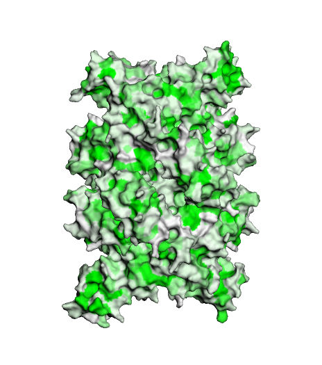
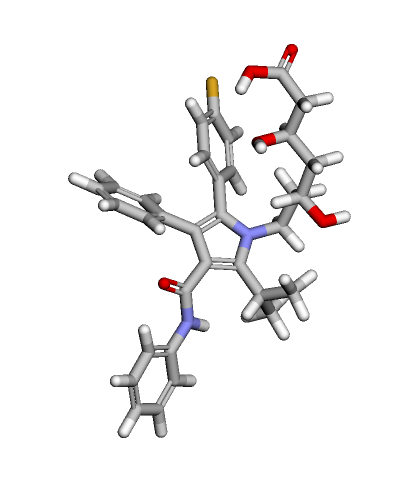
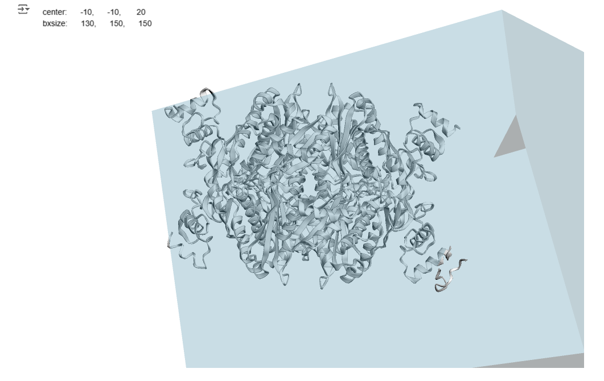
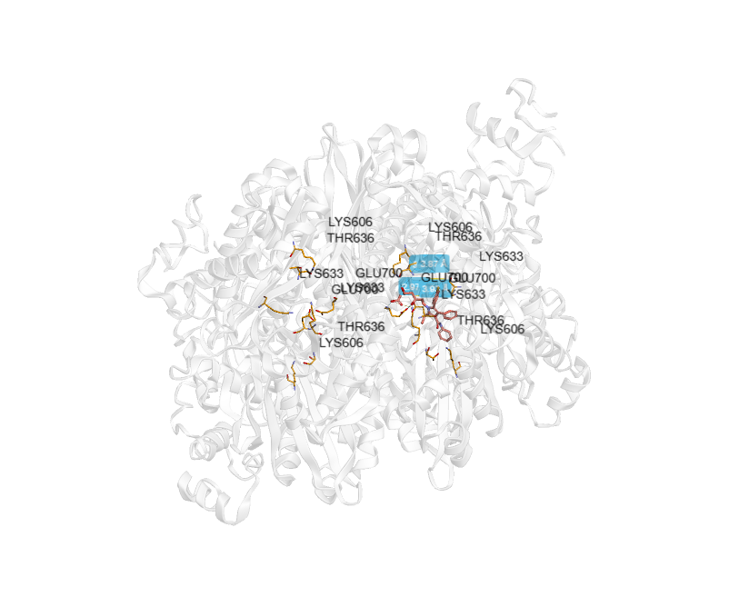
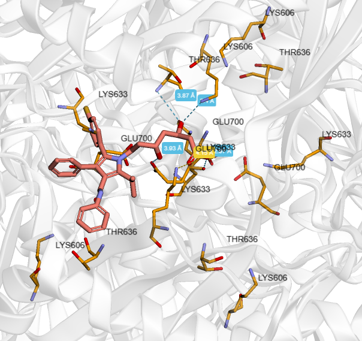

# Докинг лекарственных молекул

## Информация о препарате: Аторвастатин

### a. Действующее вещество

Действующее вещество: **Аторвастатин** (Atorvastatin).

### b. Область применения

Аторвастатин применяется для снижения концентрации холестерина и липопротеинов в плазме крови.
Он используется для лечения гиперхолестеринемии, профилактики сердечно-сосудистых заболеваний у пациентов
с высоким риском развития атеросклероза и инфаркта миокарда.
Аторвастатин также может быть назначен для вторичной профилактики после перенесённого инфаркта или инсульта,
связанного с атеросклеротическими изменениями сосудов.

### c. Молекулярный механизм действия

Аторвастатин действует путём ингибирования ГМГ-КоА-редуктазы, ключевого фермента в синтезе холестерина.
Это приводит к снижению внутриклеточного содержания холестерина и увеличению числа рецепторов ЛПНП на поверхности
клеток печени. В результате повышается захват и катаболизм ЛПНП из крови, что ведёт к снижению их концентрации в плазме.

## Ноутбук с выполненным докингом

В прикрепленном ноутбуке выполнен процесс молекулярного докинга с использованием AutoDock Vina.

- **Файл ноутбука:** [basic_molecular_docking.ipynb](./basic_molecular_docking.ipynb)

## Результат докинга в формате PDB

Результаты молекулярного докинга, включая конфигурацию лиганда в комплексе с мишенью, в формате PDB.

### Файлы с результатами докинга:

**Общий результат:** [1DQ8_1.pdb](1DQ8_1.pdb)

**Лучшая поза:** [1DQ8_1.pdb](1DQ8_1.pdb)

**Объединение лучшей позы и белка:** [1DQ8_1_cmpx.pdb](1DQ8_1_cmpx.pdb)

Результаты докинга в виде таблицы. Можно увидеть, что поза 1DQ8_1 лучшая, так как у неё самый низкий скор докинга.

| index | NAME   | DOCK\_SC | RMSD\_LB | RMSD\_UB |
|-------|--------|----------|----------|----------|
| 0     | 1DQ8_1 | -8.013   | 0.000    | 0.000    |
| 1     | 1DQ8_2 | -7.800   | 1.723    | 2.467    |
| 2     | 1DQ8_3 | -7.623	  | 1.806    | 2.567    |
| 3     | 1DQ8_4 | -7.146   | 4.058    | 9.005    |
| 4     | 1DQ8_5 | -7.103   | 2.784    | 8.714    |
| 5     | 1DQ8_6 | -6.831   | 3.941    | 7.433    |
| 6     | 1DQ8_7 | -6.783   | 29.627   | 31.688   |
| 7     | 1DQ8_8 | -6.723   | 25.458   | 28.467   |
| 8     | 1DQ8_9 | -6.563   | 50.874   | 55.489   |

## 4. Изображения

### a. Трехмерная структура подготовленного таргета

- **Изображение:** 

### b. Трехмерная структура исходного лиганда

- **Изображение:** 

### c. Полученный бокс

- **Изображение:** 

### d. Полученный докинг

- **Изображение:** 

- **Изображение:** 